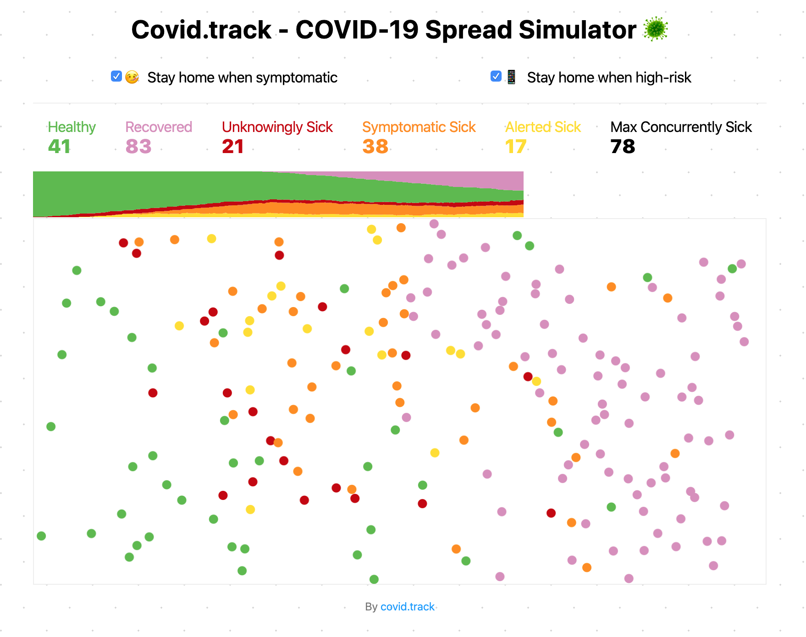

# Covid.track - spread simulator 🦠

<p float="left">
  
  
</p>

This project was used to create the simulations for a submission for the #WirVsVirus hackathon.
As part of the Corona-Tracking challenge, we were conceptualizing an app, that can provide a "corona risk score" to you, which could alert you about potentially infection before you even have symptoms.

In the simulation, we wanted to see the results of different scenarios
* people get infected but do not change their behavior, even if they have symptoms
* people start to stay at home, once they have symptoms
* people start to stay at home, once our app has alerted them

Staying at home is implemented by the dots simply not moving anymore.

## How to start

Install all the project dependencies with:
```
npm install
```

And start the development server with:
```
npm run dev
```

## What it means



The screenshot is taken in the middle of the simulation, when the symptoms and alerted boxes are checked. The dots are representing humans wandering around. The colors are indicating their healthy status.

NOTE: if not all boxes are checked, not all states are available

### Assumptions

For the simulation we assumed the following periods:
* total simulation ~ 8 weeks
* sickness period ~ 2.5 weeks
* symptoms ~ 1 week after infection
* alerted ~ 0.5 weeks after infection


## Browser support

This project is using EcmaScript Modules, therefore, only browsers with this compatibility will work. (Sorry Internet Explorer 11 and old Edge users).

## References

This repo is based on [COVID-19 (Coronavirus) spread simulator](https://github.com/midudev/covid-19-spread-simulator) which was used to create the graphics for the Washington Post Article: [Why outbreaks like coronavirus spread exponentially, and how to “flatten the curve”](https://www.washingtonpost.com/graphics/2020/world/corona-simulator/)


